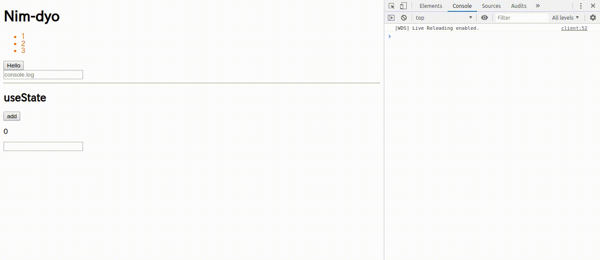

dyo
===

This is a Nim wrapper of [dyo.js](https://dyo.js.org)

# sample
```nim
import sugar, sequtils, tables, json
import ../../src/dyo

proc call() =
  window.alert("Hello")

proc input(e:Event) =
  echo e.target.value

proc updateCount(count:JsObject) =
  count.set(count.getInt()+1)


proc app():cstring {.exportc.} =
  let list = [1,2,3]
  let count = useState(0)
  let msg = useState("")

  return h("div", newJsObject(),
    h("h1", newJsObject(), "Nim-dyo"),
    h("ul", newJsObject(), list.map(
      row => h("li", JsObject{style: "color:#ff6600".cstring}, $row)
    )),
    h("button", JsObject{onclick: proc()=call()}, "Hello"),
    h("div", newJsObject(),
      h("input", JsObject{
        oninput: proc(e:Event)=input(e),
        placeholder: "console.log".cstring
      }, "")
    ),
    h("hr", newJsObject(), ""),
    h("div", newJsObject(),
      h("h2", newJsObject(), "useState"),
      h("button", JsObject{onclick: proc()=updateCount(count)}, "add"),
      h("p", newJsObject(), $count.getInt()),
      h("input", JsObject{oninput: proc(e:Event)=msg.set(e.target.value)}, ""),
      h("p", newJsObject(), msg.getCstr()),
    )
  )
```

